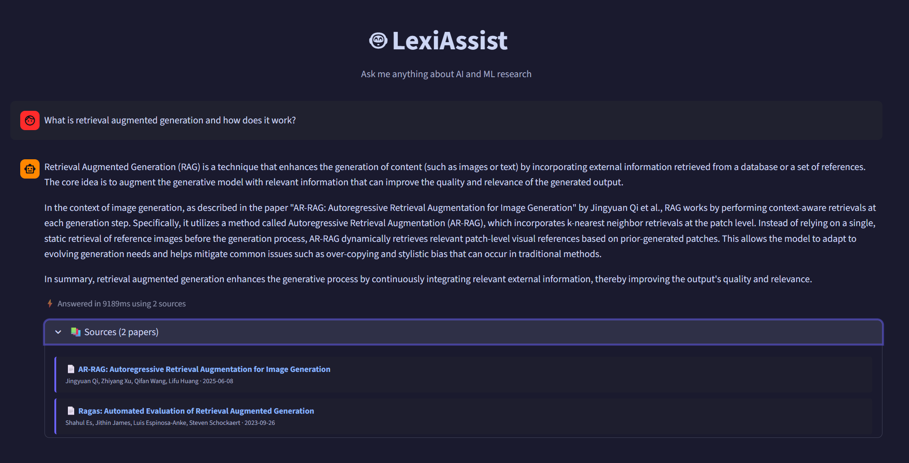
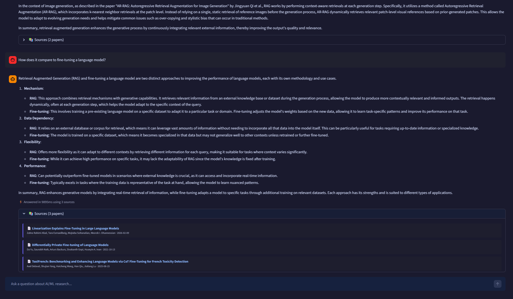
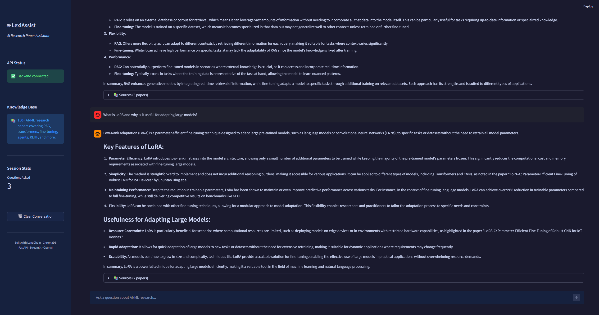
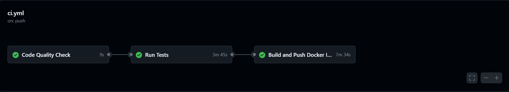

# LexiAssist 🤖

> A production-ready RAG chatbot answering questions over 150+ AI/ML research papers — with source citations, LLM evaluation, CI/CD automation, and cloud deployment.

[](https://github.com/emaadkalantarii/lexiassist/actions/workflows/ci.yml)


---

## Overview

LexiAssist is an end-to-end LLM application built to demonstrate production-level AI engineering skills. It ingests AI/ML research papers from ArXiv, stores them in a vector database, and uses Retrieval-Augmented Generation (RAG) to answer natural-language questions with grounded, cited responses.

The project covers the full AI engineering stack: data ingestion, vector embeddings, RAG pipeline, REST API, chat UI, pipeline evaluation, containerization, CI/CD automation, and cloud deployment.

---

## Demo

> The live demo is private to manage API costs. Screenshots below show the full application in action.

**Question 1 — Asking about RAG with cited sources expanded:**



**Question 2 — Follow-up showing conversation memory working:**



**Sidebar — session stats and knowledge base info:**



**CI/CD Pipeline — all three jobs passing:**



---

## Architecture

```
┌─────────────────────────────────────────────────────────────┐
│                        User Interface                       │
│                    Streamlit Chat App                       │
│                  (Streamlit Cloud · Private)                │
└─────────────────────┬───────────────────────────────────────┘
                      │ HTTP POST /chat
                      ▼
┌─────────────────────────────────────────────────────────────┐
│                     FastAPI Backend                         │
│          Pydantic validation · Conversation memory          │
│              (Docker Container · Port 8999)                 │
└─────────────────────┬───────────────────────────────────────┘
                      │
                      ▼
┌─────────────────────────────────────────────────────────────┐
│                   LangChain RAG Chain                       │
│                                                             │
│   User Question                                             │
│        │                                                    │
│        ▼                                                    │
│   OpenAI Embeddings (text-embedding-3-small)                │
│        │                                                    │
│        ▼                                                    │
│   ChromaDB Vector Store ──► Top-5 Relevant Chunks           │
│   (394 chunks · 145 papers)        │                        │
│                                    ▼                        │
│                          Prompt Template                    │
│                     (System + Context + History)            │
│                                    │                        │
│                                    ▼                        │
│                        GPT-4o-mini Generation               │
│                                    │                        │
│                                    ▼                        │
│                     Answer + Source Citations               │
└─────────────────────────────────────────────────────────────┘
                      │
                      ▼
┌─────────────────────────────────────────────────────────────┐
│                   Data Pipeline (Offline)                   │
│                                                             │
│   ArXiv API ──► 145 Papers ──► Chunking (394 chunks)        │
│   ──► OpenAI Embeddings ──► ChromaDB Persistence            │
└─────────────────────────────────────────────────────────────┘
```

---

## CI/CD Pipeline

Every push to `main` triggers a three-stage automated pipeline:

```
Push to main
     │
     ▼
┌──────────────────┐     ┌─────────────────────┐     ┌───────────────────────┐
│  Code Quality    │────►│    Run Tests        │────►│  Build & Push Docker  │
│  Check           │     │                     │     │  Image                │
│                  │     │ · Fixture test data │     │                       │
│  · flake8 lint   │     │ · Build vectorstore │     │  · docker buildx      │
│  · black format  │     │ · 6 pytest API tests│     │  · Push to Docker Hub │
└──────────────────┘     └─────────────────────┘     └───────────────────────┘
```

Docker image: [hub.docker.com/r/emaadkalantarii/lexiassist](https://hub.docker.com/r/emaadkalantarii/lexiassist)

---

## Tech Stack

| Layer | Technology | Purpose |
|-------|-----------|---------|
| LLM | OpenAI GPT-4o-mini | Answer generation |
| Embeddings | text-embedding-3-small | Semantic vector encoding |
| RAG Framework | LangChain | Pipeline orchestration |
| Vector Database | ChromaDB | Semantic similarity search |
| Backend API | FastAPI + Uvicorn | REST endpoints, validation |
| Frontend | Streamlit | Chat user interface |
| Evaluation | Custom LLM-as-judge | Pipeline quality metrics |
| Containerization | Docker + Docker Compose | Environment packaging |
| CI/CD | GitHub Actions | Automated lint/test/build |
| Cloud Deployment | Streamlit Cloud | Frontend hosting |
| Data Source | ArXiv API | Research paper ingestion |

---

## Evaluation Results

The RAG pipeline was evaluated using a custom **LLM-as-judge** framework — GPT-4o-mini scores pipeline quality across 20 hand-curated question/answer pairs.

| Metric | Score | Rating | Description |
|--------|-------|--------|-------------|
| Answer Relevancy | **0.96** | ✅ Excellent | Answers directly address the question asked |
| Faithfulness | **0.70** | 🟡 Good | Answers grounded in retrieved documents |
| Context Precision | **0.56** | 🟡 Fair | Retrieved chunks relevant to the query |
| Context Recall | **0.54** | 🟡 Fair | Context covers the needed information |

> **Note on context scores:** The knowledge base uses paper abstracts rather than full text.
> Ingesting full PDFs is the natural next improvement and would be expected to raise
> context precision and recall significantly.

---

## Project Structure

```
lexiassist/
├── backend/
│   ├── main.py                  # FastAPI app — /chat, /health, /ingest
│   ├── rag_chain.py             # LangChain RAG pipeline with memory
│   ├── embeddings.py            # ChromaDB vector store management
│   └── ingest.py                # ArXiv ingestion pipeline (145 papers)
├── frontend/
│   └── app.py                   # Streamlit UI — API-connected version
├── streamlit_app.py             # Self-contained app for cloud deployment
├── build_vectorstore.py         # One-time embedding and indexing script
├── evaluation/
│   ├── evaluate.py              # LLM-as-judge evaluation pipeline
│   ├── eval_dataset.json        # 20 hand-curated Q&A evaluation pairs
│   └── eval_results.json        # Full evaluation results
├── tests/
│   └── test_api.py              # 6 pytest tests for FastAPI endpoints
├── tests/fixtures/
│   └── sample_documents.json    # Fixture data for CI testing
├── data/
│   └── processed/
│       └── documents.json       # 145 structured ArXiv documents
├── .github/
│   └── workflows/
│       └── ci.yml               # GitHub Actions pipeline
├── docs/
│   └── screenshots/             # App screenshots
├── Dockerfile                   # Container definition
├── docker-compose.yml           # Multi-service orchestration
├── .env.example                 # Environment variable template
└── requirements.txt             # Python dependencies
```

---

## Quick Start

### Prerequisites
- Python 3.11+
- Docker Desktop
- OpenAI API key ([get one here](https://platform.openai.com))

### Local Setup

```bash
# Clone the repository
git clone https://github.com/emaadkalantarii/lexiassist.git
cd lexiassist

# Create virtual environment
python -m venv venv
venv\Scripts\activate          # Windows
# source venv/bin/activate      # macOS/Linux

# Install dependencies
pip install -r requirements.txt

# Configure environment
cp .env.example .env
# Edit .env and add your OPENAI_API_KEY

# Download papers and build vector store (one-time, ~2 min)
python backend/ingest.py
python build_vectorstore.py
```

### Run Locally

```bash
# Terminal 1 — FastAPI backend
uvicorn backend.main:app --reload --port 8000

# Terminal 2 — Streamlit frontend
streamlit run frontend/app.py
```

- Chat UI: `http://localhost:8501`
- API docs: `http://localhost:8000/docs`
- Health check: `http://localhost:8000/health`

---

## Docker

```bash
# Build and start all services
docker compose up

# Run in background
docker compose up -d

# Stop all services
docker compose down
```

Services after startup:
- FastAPI API: `http://localhost:8999`
- Streamlit UI: `http://localhost:8501`

Pull directly from Docker Hub:

```bash
docker pull emaadkalantarii/lexiassist:latest
```

---

## API Reference

### `POST /chat`

Send a question and receive a grounded answer with source citations.

**Request:**
```json
{
  "question": "What is retrieval augmented generation?",
  "chat_history": [
    {"role": "user", "content": "Previous question"},
    {"role": "assistant", "content": "Previous answer"}
  ]
}
```

**Response:**
```json
{
  "answer": "Retrieval Augmented Generation (RAG) combines a retrieval system...",
  "sources": [
    {
      "title": "Retrieval-Augmented Generation for Knowledge-Intensive NLP Tasks",
      "authors": "Patrick Lewis et al.",
      "published": "2021-04-12",
      "url": "http://arxiv.org/abs/2005.11401"
    }
  ],
  "processing_time_ms": 2341
}
```

### `GET /health`

Returns API health status and version.

### `POST /ingest`

Triggers the full ArXiv ingestion and vectorstore rebuild pipeline.

---

## Running Tests

```bash
python -m pytest tests/ -v
```

6 tests covering: health check, basic chat, conversation history,
empty input validation, missing field validation, and source citation format.

---

## Environment Variables

Copy `.env.example` to `.env` and configure:

| Variable | Description | Default |
|----------|-------------|---------|
| `OPENAI_API_KEY` | OpenAI API key (required) | — |
| `LLM_MODEL` | Generation model | `gpt-4o-mini` |
| `EMBEDDING_MODEL` | Embedding model | `text-embedding-3-small` |
| `CHUNK_SIZE` | Document chunk size in chars | `1000` |
| `CHUNK_OVERLAP` | Overlap between chunks | `200` |
| `TOP_K_RESULTS` | Retrieved chunks per query | `5` |
| `API_BASE_URL` | FastAPI URL for Streamlit | `http://localhost:8999` |

---

## License

MIT License — see [LICENSE](LICENSE) for details.

---

## Author

**Emad Kalantari**
Master's in Information and Computer Sciences, University of Luxembourg

[LinkedIn](https://linkedin.com/in/emaadkalantarii) · [GitHub](https://github.com/emaadkalantarii) · [Website](https://emadkalantari.com)


