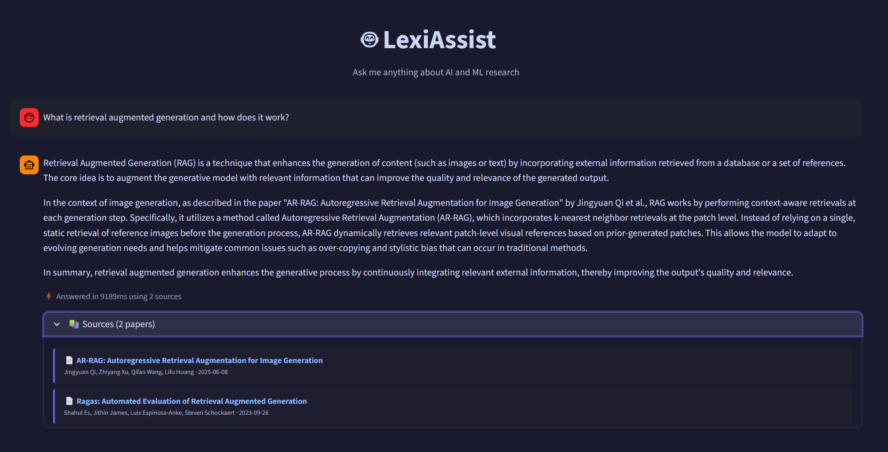
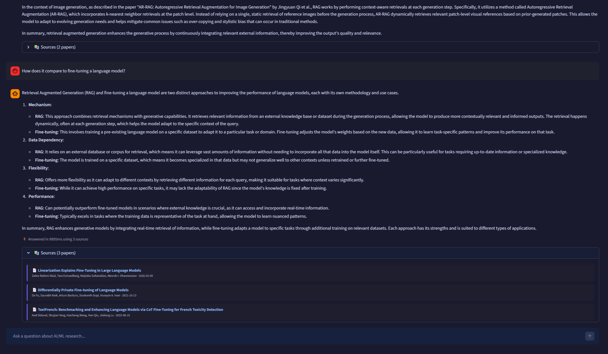
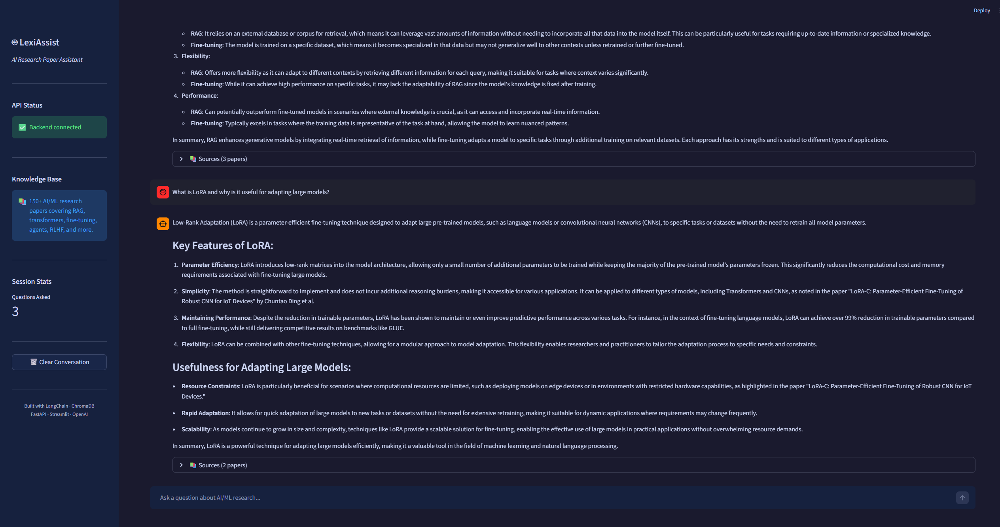
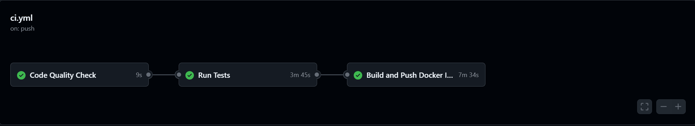

# LexiAssist 🤖

> A production-ready RAG chatbot answering questions over 150+ AI/ML research papers — with source citations, LLM-as-judge evaluation, CI/CD automation, and full containerized deployment.

[](https://github.com/emaadkalantarii/lexiassist/actions/workflows/ci.yml)


---

## Table of Contents

- [Overview](#overview)
- [Demo](#demo)
- [Architecture](#architecture)
- [CI/CD Pipeline](#cicd-pipeline)
- [Tech Stack](#tech-stack)
- [Evaluation Results](#evaluation-results)
- [Pipeline Walkthrough](#pipeline-walkthrough)
- [Getting Started](#getting-started)
  - [Option A — Docker (Recommended)](#option-a--docker-recommended)
  - [Option B — Local Python Setup](#option-b--local-python-setup)
- [API Reference](#api-reference)
- [Running Tests](#running-tests)
- [Project Structure](#project-structure)
- [Environment Variables](#environment-variables)
- [Skills Demonstrated](#skills-demonstrated)
- [Future Improvements](#future-improvements)
- [License](#license)
- [Author](#author)

---

## Overview

LexiAssist is an end-to-end LLM application demonstrating production-level AI engineering across the full stack. It ingests AI/ML research papers from ArXiv, stores them in a vector database, and uses Retrieval-Augmented Generation (RAG) to answer natural-language questions with grounded, cited responses.

The project covers every layer of a real AI product: automated data ingestion, semantic embeddings, RAG pipeline with conversational memory, a REST API backend, an interactive chat UI, pipeline quality evaluation, Docker containerization, and GitHub Actions CI/CD.

**Key project stats:**
- 145 papers ingested across 15 AI/ML topics
- 394 indexed chunks in ChromaDB
- 6 automated API tests
- 4 evaluation metrics across 20 hand-curated questions
- Full CI/CD pipeline: lint → test → Docker push on every commit

---

## Demo

> The app runs locally and is not publicly hosted to avoid uncontrolled OpenAI API usage —
> a deliberate engineering decision to manage costs responsibly.
> Screenshots below show the full application running locally.

**Question 1 — Asking about RAG with cited sources expanded:**



**Question 2 — Follow-up demonstrating conversational memory:**



> The second question ("How does it compare to fine-tuning?") contains no context on its own.
> The chatbot answers correctly only because it retains the previous conversation — demonstrating
> that the conversation memory pipeline is working.

**Session stats and knowledge base info visible in the sidebar:**



**CI/CD pipeline — all three jobs passing on every push:**



---

## Architecture

```
┌─────────────────────────────────────────────────────────────┐
│                       User Interface                         │
│                   Streamlit Chat App                         │
│                    (localhost:8501)                          │
└─────────────────────┬───────────────────────────────────────┘
                      │  HTTP POST /chat
                      ▼
┌─────────────────────────────────────────────────────────────┐
│                    FastAPI Backend                           │
│        Pydantic validation · Conversation memory            │
│          Logging · Error handling · /docs UI                 │
│                    (localhost:8000)                          │
└─────────────────────┬───────────────────────────────────────┘
                      │
                      ▼
┌─────────────────────────────────────────────────────────────┐
│                  LangChain RAG Chain                         │
│                                                              │
│  User Question                                               │
│       │                                                      │
│       ▼                                                      │
│  OpenAI Embeddings (text-embedding-3-small)                  │
│       │                                                      │
│       ▼                                                      │
│  ChromaDB Vector Store ──► Top-5 Relevant Chunks            │
│  (394 chunks · 145 papers)        │                         │
│                                   ▼                          │
│                    Prompt Template                           │
│              (System + Context + Chat History)               │
│                                   │                          │
│                                   ▼                          │
│                      GPT-4o-mini Generation                  │
│                                   │                          │
│                                   ▼                          │
│                   Answer + Source Citations                  │
└─────────────────────────────────────────────────────────────┘
                      │
                      ▼
┌─────────────────────────────────────────────────────────────┐
│                 Offline Data Pipeline                        │
│                                                              │
│  ArXiv API ──► 145 Papers ──► Text Chunking (394 chunks)    │
│       ──► OpenAI Embeddings ──► ChromaDB Persistence        │
└─────────────────────────────────────────────────────────────┘
```

---

## CI/CD Pipeline

Every push to `main` automatically triggers a three-stage pipeline via GitHub Actions:

```
Push to main
     │
     ▼
┌─────────────────┐     ┌───────────────────────┐     ┌─────────────────────────┐
│  Code Quality   │────►│     Run Tests          │────►│  Build & Push Docker    │
│  Check          │     │                        │     │  Image                  │
│                 │     │  · Fixture test data   │     │                         │
│  · flake8 lint  │     │  · Build vectorstore   │     │  · docker buildx        │
│  · black format │     │  · 6 pytest API tests  │     │  · Push to Docker Hub   │
└─────────────────┘     └───────────────────────┘     └─────────────────────────┘
```

The test job uses a small fixture dataset instead of live ArXiv calls — keeping CI fast,
free, and independent of external APIs. This is an intentional engineering decision:
tests should never depend on external services.

Docker image: [hub.docker.com/r/emaadkalantarii/lexiassist](https://hub.docker.com/r/emaadkalantarii/lexiassist)

---

## Tech Stack

| Layer | Technology | Purpose |
|-------|-----------|---------|
| LLM | OpenAI GPT-4o-mini | Answer generation |
| Embeddings | text-embedding-3-small | Semantic vector encoding |
| RAG Framework | LangChain | Pipeline orchestration |
| Vector Database | ChromaDB | Semantic similarity search |
| Backend API | FastAPI + Uvicorn | REST endpoints, validation |
| Frontend | Streamlit | Interactive chat UI |
| Evaluation | Custom LLM-as-judge | Pipeline quality measurement |
| Containerization | Docker + Docker Compose | Environment packaging |
| CI/CD | GitHub Actions | Automated lint, test, build |
| Image Registry | Docker Hub | Container distribution |
| Data Source | ArXiv API | Research paper ingestion |

---

## Evaluation Results

The RAG pipeline quality was measured using a custom **LLM-as-judge** framework — GPT-4o-mini scores each metric independently across 20 hand-curated question/answer pairs. This approach mirrors what production evaluation frameworks like RAGAs do internally.

| Metric | Score | Rating | What It Measures |
|--------|-------|--------|-----------------|
| Answer Relevancy | **0.96** | ✅ Excellent | Does the answer address the question asked? |
| Faithfulness | **0.70** | 🟡 Good | Is the answer grounded in the retrieved documents? |
| Context Precision | **0.56** | 🟡 Fair | Are the retrieved chunks relevant to the query? |
| Context Recall | **0.54** | 🟡 Fair | Does the context contain what's needed to answer? |

> **Why context scores are lower:** The knowledge base uses paper abstracts only, not full text.
> Ingesting complete PDFs is the most direct path to improving context precision and recall.
> Answer relevancy at 0.96 confirms the generation step is working very well.

---

## Pipeline Walkthrough

### Phase 1 — Data Ingestion (`backend/ingest.py`)

Queries the ArXiv API across 15 AI/ML topic areas (RAG, transformers, fine-tuning, LoRA, agents, RLHF, and more), fetching 10 papers per topic. Results are deduplicated by ArXiv ID to prevent the same paper appearing twice. Metadata — title, abstract, authors, publication date, categories, URL — is structured into a LangChain-compatible document format. Raw paper data is saved to `data/raw/papers.json` and the processed documents to `data/processed/documents.json`.

### Phase 2 — Chunking & Embedding (`backend/embeddings.py`)

Loads the 145 processed documents and splits them using LangChain's `RecursiveCharacterTextSplitter` with 1,000-character chunks and 200-character overlap. The splitter tries paragraph boundaries first, then sentence boundaries, then word boundaries — preserving semantic coherence. Each chunk is embedded using OpenAI's `text-embedding-3-small` model, producing a 1,536-dimensional vector. All 394 vectors are stored in ChromaDB with their source metadata and persisted to disk.

### Phase 3 — RAG Chain (`backend/rag_chain.py`)

When a question is received, it is embedded using the same model and ChromaDB returns the 5 most semantically similar chunks. These chunks are formatted into a context block and injected into a prompt template alongside the conversation history (as LangChain `HumanMessage` / `AIMessage` objects) and a system prompt that instructs the LLM to stay grounded, cite sources, and refuse to fabricate. GPT-4o-mini generates the answer. Source metadata is extracted from the retrieved chunks, deduplicated by title, and returned alongside the answer.

### Phase 4 — FastAPI Backend (`backend/main.py`)

The RAG chain is wrapped in a FastAPI application with three endpoints. The `POST /chat` endpoint accepts a question and optional chat history, validates the request body against Pydantic models, calls the RAG chain, records processing time, and returns the answer with sources. The `GET /health` endpoint returns the server status and version. The `POST /ingest` endpoint triggers the full ingestion and vectorstore rebuild pipeline programmatically. The chain is preloaded at startup via the lifespan handler to avoid first-request latency.

### Phase 5 — Evaluation (`evaluation/evaluate.py`)

A custom LLM-as-judge evaluation framework runs GPT-4o-mini as the evaluator across four metrics. Faithfulness prompts the LLM to rate how well the answer is grounded in the retrieved context. Answer relevancy rates how directly the answer addresses the question. Context precision asks yes/no whether each retrieved chunk is relevant to the query and averages the results. Context recall rates how well the context covers the information needed to produce the ground truth answer. All scores are saved to `eval_results.json` with per-sample breakdowns.

---

## Getting Started

You have two options depending on your preference. **Option A (Docker)** is the fastest
way to get the app running — no Python setup required. **Option B (Local)** is for
development or if you want to modify the code.

### Prerequisite for Both Options

You need an **OpenAI API key**. Get one at [platform.openai.com](https://platform.openai.com).

---

### Option A — Docker (Recommended)

The fastest way to run LexiAssist. Requires only Docker Desktop and an OpenAI API key.
No Python installation, no dependency management, no setup scripts.

**Step 1 — Install Docker Desktop**

Download and install from [docker.com/products/docker-desktop](https://www.docker.com/products/docker-desktop).
Start Docker Desktop and wait until the engine is running.

**Step 2 — Clone the repository**

```bash
git clone https://github.com/emaadkalantarii/lexiassist.git
cd lexiassist
```

**Step 3 — Configure your API key**

```bash
cp .env.example .env
```

Open `.env` and set your key:

```
OPENAI_API_KEY=sk-proj-your-key-here
```

**Step 4 — Run the data pipeline (one-time setup)**

Before starting the containers, download the papers and build the vector store.
This runs inside Docker so no local Python is needed:

```bash
docker compose run --rm api python backend/ingest.py
docker compose run --rm api python build_vectorstore.py
```

This takes about 2–3 minutes and only needs to be done once — the data is saved locally.

**Step 5 — Start the application**

```bash
docker compose up
```

Both services start automatically:

| Service | URL | Description |
|---------|-----|-------------|
| Streamlit UI | http://localhost:8501 | Chat interface |
| FastAPI backend | http://localhost:8999 | REST API |
| API docs | http://localhost:8999/docs | Interactive Swagger UI |
| Health check | http://localhost:8999/health | API status |

```bash
# Stop all services
docker compose down

# Run in the background
docker compose up -d
```

Or pull the pre-built image from Docker Hub without cloning:

```bash
docker pull emaadkalantarii/lexiassist:latest
```

---

### Option B — Local Python Setup

Use this option if you want to explore, modify, or extend the code.

**Step 1 — Clone and set up the environment**

```bash
git clone https://github.com/emaadkalantarii/lexiassist.git
cd lexiassist

python -m venv venv
venv\Scripts\activate          # Windows
# source venv/bin/activate      # macOS/Linux

pip install -r requirements.txt
```

**Step 2 — Configure environment variables**

```bash
cp .env.example .env
```

Open `.env` and add your OpenAI API key.

**Step 3 — Run the data pipeline (one-time setup)**

```bash
# Download 145 papers from ArXiv (~2 min)
python backend/ingest.py

# Embed and index all documents into ChromaDB (~1 min)
python build_vectorstore.py
```

**Step 4 — Start both services**

Open two terminals:

```bash
# Terminal 1 — FastAPI backend
uvicorn backend.main:app --reload --port 8000

# Terminal 2 — Streamlit frontend
streamlit run frontend/app.py
```

| Service | URL |
|---------|-----|
| Streamlit UI | http://localhost:8501 |
| API docs | http://localhost:8000/docs |
| Health check | http://localhost:8000/health |

---

## API Reference

### `POST /chat`

Send a question and receive a grounded answer with source citations.

**Request body:**
```json
{
  "question": "What is retrieval augmented generation?",
  "chat_history": [
    {"role": "user", "content": "Previous question"},
    {"role": "assistant", "content": "Previous answer"}
  ]
}
```

**Response:**
```json
{
  "answer": "Retrieval Augmented Generation (RAG) combines a retrieval system...",
  "sources": [
    {
      "title": "Retrieval-Augmented Generation for Knowledge-Intensive NLP Tasks",
      "authors": "Patrick Lewis et al.",
      "published": "2021-04-12",
      "url": "http://arxiv.org/abs/2005.11401"
    }
  ],
  "processing_time_ms": 2341
}
```

### `GET /health`

Returns API health status, version, and environment.

### `POST /ingest`

Triggers the full ArXiv ingestion and vectorstore rebuild pipeline programmatically.

---

## Running Tests

```bash
# Option A — inside Docker
docker compose run --rm api python -m pytest tests/ -v

# Option B — local Python
python -m pytest tests/ -v
```

The test suite covers: health check endpoint, basic chat with a question, multi-turn
conversation history, empty input rejection (422), missing field rejection (422),
and source citation field validation — 6 tests total.

---

## Project Structure

```
lexiassist/
├── backend/
│   ├── main.py                  # FastAPI app — /chat, /health, /ingest endpoints
│   ├── rag_chain.py             # LangChain RAG pipeline with conversation memory
│   ├── embeddings.py            # ChromaDB vector store management
│   └── ingest.py                # ArXiv data ingestion (145 papers, 15 topics)
├── frontend/
│   └── app.py                   # Streamlit chat UI connected to FastAPI
├── streamlit_app.py             # Self-contained version (no separate API needed)
├── build_vectorstore.py         # One-time script to embed and index all documents
├── evaluation/
│   ├── evaluate.py              # LLM-as-judge evaluation pipeline
│   ├── eval_dataset.json        # 20 hand-curated Q&A evaluation pairs
│   └── eval_results.json        # Full per-sample evaluation results
├── tests/
│   ├── test_api.py              # 6 pytest tests for all FastAPI endpoints
│   └── fixtures/
│       └── sample_documents.json  # Lightweight fixture data for CI testing
├── data/
│   └── processed/
│       └── documents.json       # 145 structured ArXiv documents
├── .github/
│   └── workflows/
│       └── ci.yml               # GitHub Actions — lint → test → docker push
├── docs/
│   └── screenshots/             # App screenshots used in this README
├── Dockerfile                   # Container image definition
├── docker-compose.yml           # Multi-service local orchestration
├── .env.example                 # Environment variable reference
├── conftest.py                  # pytest path configuration
└── requirements.txt             # Python dependencies
```

---

## Environment Variables

| Variable | Description | Default |
|----------|-------------|---------|
| `OPENAI_API_KEY` | OpenAI API key — required | — |
| `LLM_MODEL` | Generation model name | `gpt-4o-mini` |
| `EMBEDDING_MODEL` | Embedding model name | `text-embedding-3-small` |
| `CHUNK_SIZE` | Max characters per document chunk | `1000` |
| `CHUNK_OVERLAP` | Character overlap between chunks | `200` |
| `TOP_K_RESULTS` | Number of chunks retrieved per query | `5` |
| `API_BASE_URL` | FastAPI URL used by Streamlit | `http://localhost:8000` |
| `ENVIRONMENT` | Runtime environment label | `development` |

---

## Skills Demonstrated

**LLM Engineering & RAG:**
- Retrieval-Augmented Generation pipeline design and implementation end-to-end
- Semantic chunking strategy (chunk size, overlap, separator hierarchy)
- Vector embedding generation and ChromaDB persistence
- Prompt engineering for hallucination mitigation and structured citation output
- Multi-turn conversational memory using LangChain message history
- LLM orchestration with LangChain chains and output parsers

**Evaluation & Quality:**
- Custom LLM-as-judge evaluation framework built from scratch
- Four RAG-specific metrics: faithfulness, answer relevancy, context precision, context recall
- Hand-curated ground truth dataset of 20 question/answer pairs
- Documented analysis of metric limitations and improvement paths

**Backend & API Design:**
- FastAPI REST API with Pydantic request/response validation
- CORS middleware for cross-origin frontend access
- App lifespan management for startup preloading
- Automatic Swagger UI documentation generation
- Structured error handling with HTTP exceptions and logging

**DevOps & Production Engineering:**
- Docker containerization with multi-service Docker Compose
- Volume mounts for data and vectorstore persistence
- GitHub Actions CI/CD pipeline with three sequential jobs
- Fixture-based testing that avoids external API calls in CI
- Docker Hub image publishing on every push to main
- Code quality automation with flake8 linting and black formatting

**Software Engineering:**
- Modular codebase with clear separation of concerns across backend, frontend, evaluation
- pytest API testing with six test cases covering both happy paths and validation errors
- Environment variable management with `.env` and `.env.example`
- Professional Git workflow with descriptive commit history

---

## Future Improvements

- **Full PDF ingestion** — replace abstract-only indexing with complete paper text using `pypdf` or `arxiv` full-text download; expected to significantly improve context precision and recall scores
- **Re-ranking** — add a cross-encoder re-ranking step after initial retrieval to improve chunk relevance before passing to the LLM
- **Hybrid search** — combine semantic vector search with BM25 keyword search for better retrieval on specific technical terms
- **Streaming responses** — connect the FastAPI streaming support (already implemented in the backend) to the Streamlit UI for word-by-word response rendering
- **AWS EC2 deployment** — deploy the FastAPI backend to an EC2 instance behind nginx for a fully public production URL
- **Expanded knowledge base** — add more paper sources (Semantic Scholar, PubMed) and increase topic coverage beyond the current 15 AI/ML domains
- **User feedback loop** — add thumbs up/down feedback on answers to collect data for evaluating and improving retrieval quality over time

---

## License

MIT License — see [LICENSE](LICENSE) for details.

---

## Author

**Emad Kalantari**

Master's in Information and Computer Sciences — University of Luxembourg

[](https://linkedin.com/in/emaadkalantarii)
[](https://github.com/emaadkalantarii)
[](https://emadkalantari.com)
